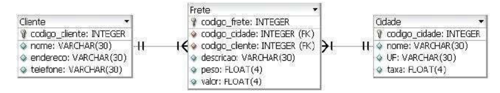

# Laboratório de Engenharia de Software II
## 📜 Descrição da atividade
Implementação de Testes para uma API REST usando Spring Bootpara um fragmento de um sistema de Transportadora.

## 📚 Questões
1. Camada de Modelo – Mapear as entidades com as anotações JPA
2. Você deverá anotar as validações com o Bean Validation nas classes do modelo
3. Camada de Repositório (deverá ser implementada com Spring Data JPA)
4. Camada de Serviço – Sugestão FreteService
5. Camada de Controle – API REST

## 🛠️ Modelo de banco de dados do sistema de Frete a ser considerado

## 👨‍🎓 Aluno
Lucas Ferreira - [ **GitHub**][github.lucas]  
Tadeu Viegas - [ **GitHub**][github.tadeu]

## 🔗 Sobre
Atividade 05 - Teste de API desenvolvida com Spring Boot  
Sistemas de Informação - DCOMP/IFMA  
Professor: Joao Carlos Pinheiro  
Engenharia de Software II

[github.lucas]: <https://github.com/LucasFelip>
[github.tadeu]: <https://github.com/TadeuViegas>
